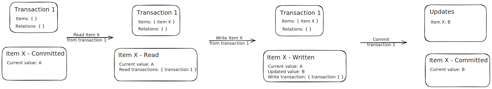

# Transactions #

The Relation Graph Engine manages a graph of objects (items and
relations) that is versioned over time. Past versions of these objects
are preserved as read-only data. Only the current state is mutable: we
do not allow changes "in the past".

At the moment, the engine loads the "current" state on startup and
keeps it in memory, both to allow us to guarantee consistent writes to
the database and to speed up operations. A drawback of this approach
is that it limits the size of the state at every single point in time
to what can fit in the available memory, and that the relation graph
engine needs to assume exclusive access to the database.

To escape these limitations and make the relation graph engine
horizontally scalable, it would be interesting to research switching
to a database with a data model that is more adapted to our data
(i.e. a graph database) and that can provide the necessary guarantees
(transaction support).

## Versioning

Every object (item or relation) in the `items` index gets a unique
`object_id`, as well as a `@from` (required) and `@to` (optional)
field. When an object is created, `@from` is set to the current time
and `@to` is unset. To update an object, the previous version's `@to`
field is set to the current time, and a new version (document with the
same `object_id`) is inserted with `@from` set to the current time and
`@to` unset. To remove an object, the last version's `@to` field is
set to the current time.

The only modification done to existing documents, is to set `@to` on
documents where it was previously unset. Documents with unset `@to`
must therefore be kept in a writeable index. As soon as `@to` is set,
the document can be transferred to read-only storage.

## Reading from a consistent snapshot

When reading data to be shown on the GUI, it suffices to ensure that
the data read from a consistent snapshot for a particular point in
time. Since we do not allow changes "in the past", this can be done by
querying for objects alive at a particular timestamp or over a time
range ending before the internal `current` time. Before running such
query on the database, however, we need to make sure the updates sent
up to that point have actually become visible, by issuing a `refresh`
request to Opensearch.

A way to avoid expensive `refresh` requests to the database, would be
to keep an in-memory cache of all updates inside the refresh window
(the max period between refreshes configured in opensearch). In that
scenario, objects in the refresh window would be loaded to the cache
on startup (after a refresh request) and updates would be sent to the
cache as well as to the database. Queries for data inside the refresh
window would be serviced from the cache instead of querying the
database. The cache would be periodically cleared of updates no longer
contained inside the refresh window, that are guaranteed to have
become visible in the database. This cache mechanism is not currently
implemented.

## Single-operation updates

Making changes to the graph usually involves modifications to multiple
objects at once. For example, when an item is removed, all relations
in which that item takes part must be removed as well. Atomic updates
to the in-memory graph data are easily guaranteed by placing a
synchronous `RwLock` around it and taking a read or write lock, as
appropriate, over the course of every operation.

When sending updates to the database, however, care should be taken to
ensure they are processed in the right order. This is done in the
DBDaemon by storing a `version` number together with the current
document number, and increasing it for every update. This version
number is sent with the update operation to Opensearch, which will
only accept the latest version.

A similar mechanism should be implemented for the updates sent from
the Relation Graph to the DBDaemon, or ideally, the DBDaemon should be
integrated as a library into the Relation Graph Engine directly.
Without this, the way to ensure correct serialization of requests to
the DBDaemon would be to hold an exclusive asynchronous lock during
the request, which would make concurrent write requests impossible.

## Multi-operation updates

When changes are made by discovery services through the API, it is
often necessary to be able to guarantee that the data read is
up-to-date, and that an update consisting of multiple operations (read
and write), is processed as one logical unit. To make this possible on
top of Opensearch, which does not provide transaction support, a
lock-free in-memory transaction algorithm was implemented in the
Relation Graph Engine.

To add transaction support the (resolved) relation graph structures
have been made generic over a wrapper singleton type, implementing the
`Wrapper` trait. This allows wrapping the individual items and
relations in the recursive structure in a `Tx` enum, and is also used,
for example, when adding status information to a collection of
objects.

The `Tx` enum represents the transactional state of an object. It has
the following variants:

- Committed: the object is not involved in any transaction. This
  variant contains the current value.

- Read: the object has been read in one or more transactions. In
  addition to the current value, this variant contains a list of
  references to the transactions in which this object was read.

- Written: the object has been updated in a transaction. The variant
  contains the current value, the updated value and a pointer to the
  transaction in which this object was updated.

The relation graph state contains a `TxItems` structure, containing
the objects wrapped in `Tx`, as well as a map of `TransactionId`s to
`Transaction` objects. The `Transaction` object contains a list of
items and relations read or written in the transaction.

When an external service requests to start a transaction, a new
transaction object is created and inserted in the map of transactions,
returning the transaction id to the service. The transaction id is
provided by the service in any subsequent transactional operation APIs
it executes. To make the transaction algorithm lock-free, all
transactional operations can fail with a restart message, indicating
that the another transaction conflicted with this one, and the service
should retry the transaction from the start. Note that this can be
done by wrapping a pure function and catching the specific error.

Both transactional reads and transactional writes require a
synchronous write lock on the internal state. This is because, even
for reads, the state of an object may need to be updated. At the start
of every transactional operation, a reference to the transaction
object is required. If the transaction is marked as cancelled, the
transaction object is removed from the map of transactions and a
restart error is returned.

When executing transactional reads, objects in the `Committed` or
`Read` states are set to the `Read` state and the transaction is added
to the list of transactions if necessary. If the object in question is
in the `Write` state and the writing transaction is the current one,
it remains in the same state. If the write transaction is not the
current one, there is a conflict and the other transaction needs to be
cancelled. A pointer to the transactional object state is added to the
transaction object.

For transactional writes, objects in the `Committed` state are set to
the `Written` state, the updated value is set and the transaction
field is set to point to the current transaction. If the object is in
the `Read` state, all read transactions except the current one are
cancelled, before transitioning the object to the `Written` state as
described above. If the object is in the `Written` state and the write
transaction equals the current one, only the value is updated. If the
write transaction is not the current one, it needs to be cancelled. A
pointer to the transactional object state is added to the transaction
object.

To cancel a transaction (either because it conflicts with another
transaction or because the external service requested a rollback), we
visit all the items and relations referenced in the transation
object. For objects in the `Read` state, we remove the transaction to
be cancelled from the map of read transactions. If the list of read
transactions is empty after this, the state is set to `Committed`. For
objects in the `Written` state, the state is set to `Committed`,
discarding the updated value. In this case, we can verify that the
write transaction must be the transaction to be cancelled. Finally, if
we are cancelling a conflicting transaction, the transaction object
stored in the transaction map is set to `None`, in order to return a
restart error on the next transactional request from the transaction
owner. For explicit rollback requests, the transation object can be
removed from the map straight away.

Committing a transaction is always done by explicit request from the
external service running the transaction. To do so, we visit all the
items and relations referenced in the transation object. For objects
in the `Read` state, we remove the transaction to be committed from
the map of read transactions. If the list of read transactions is
empty after this, the state is set to `Committed`. For objects in the
`Written` state (in which case the transaction being committed must be
the write transaction), the state is set to `Committed` with the
updated value as current value, or it is removed from the state if the
updated value is `None`. The update (create, update or remove) is also
added to the list of updates to be written to the database. When the
commit is finished, the list of update operations is sent to the
DBDaemon and success is returned to the external service.

